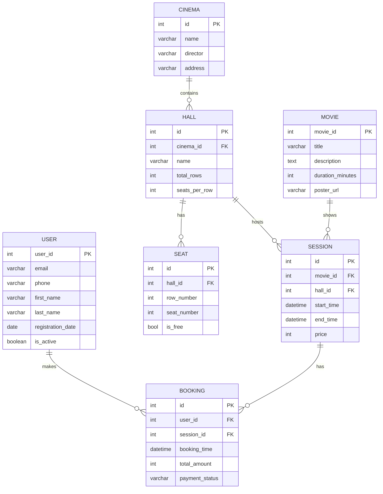

```mermaid
erDiagram
USER {
int user_id PK
varchar email
varchar phone
varchar first_name
varchar last_name
date registration_date
boolean is_active
}

    CINEMA {
        int id PK
        varchar name
        varchar director
        varchar address
    }

    HALL {
        int id PK
        int cinema_id FK
        varchar name
        int total_rows
        int seats_per_row
    }

    MOVIE {
        int movie_id PK
        varchar title
        text description
        int duration_minutes
        varchar poster_url
    }

    SESSION {
        int id PK
        int movie_id FK
        int hall_id FK
        datetime start_time
        datetime end_time
        int price
    }

    SEAT {
        int id PK
        int hall_id FK
        int row_number
        int seat_number
        bool is_free
    }

    BOOKING {
        int id PK
        int user_id FK
        int session_id FK
        datetime booking_time
        int total_amount
        varchar payment_status
    }

    USER ||--o{ BOOKING : makes
    CINEMA ||--o{ HALL : contains
    HALL ||--o{ SEAT : has
    HALL ||--o{ SESSION : hosts
    MOVIE ||--o{ SESSION : shows
    SESSION ||--o{ BOOKING : has
```